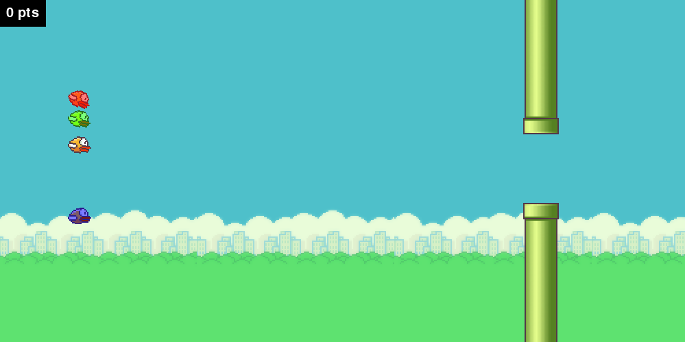
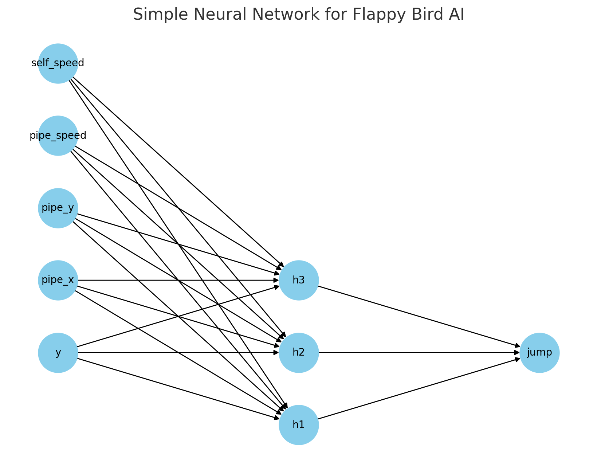
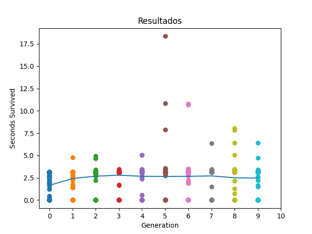

# 🐤 Flappy Bird AI

A Python-based **Flappy Bird** clone featuring up to **2 human players and an AI agent** powered by **NEAT (NeuroEvolution of Augmenting Topologies)**. The game is built using **Pygame**, with **Matplotlib** used for visualizing AI training progress.



---

## 🚀 Features

- 🧠 NEAT-powered AI that learns to play Flappy Bird
- 🎮 Supports up to 2 human players + 1 AI simultaneously
- 📈 Real-time training graphs with Matplotlib
- 🐍 Pure Python implementation using `pygame`, `neat-python`, `numpy` and `matplotlib`
- 💾 Save/load trained AI genomes

---

## 🧠 AI Learning with NEAT

The AI uses the [NEAT algorithm](https://neat-python.readthedocs.io/en/latest/) to evolve a neural network capable of navigating the pipes. The input features include:

- Distance to next pipe
- Height difference between bird and gap
- Vertical velocity
- Horizontal velocity of the pipe

The output is a simple decision: **flap or not**.



---

## 🕹️ Controls

| Player   | Action | Key                |
| -------- | ------ | ------------------ |
| Player 1 | Flap   | `Q`                |
| Player 2 | Flap   | `P`                |
| Player 3 | Flap   | `B`                |
| AI       | -      | Controlled by NEAT |

---

## 🧰 Setup Instructions

### 1. Clone the Repository

```bash
git clone https://github.com/RafaelSetton/Flappy-Bird.git
cd Flappy-Bird
```

### 2. Install Dependencies

```bash
pip install -r requirements.txt
```

### 3. Run the Game

To play against another player and/or the AI:

```bash
python main.py play
```

To train the AI:

```bash
python main.py train
```

---

## 🗂️ Project Structure

```
Flappy-Bird/
├── data/
|   ├── genomes/         # Pickle files containing saved genomes
|   └── highscores.json  # Highscores data
├── images/              # Screenshots and graphs
├── src/
|   ├── ai/              # Python files to train and use the AI
|   ├── assets/          # Images that will be rendered on screen
|   └── ...              # All other python files
├── .gitignore
├── main.py              # Main game loop (with multiplayer + AI)
├── NEAT_config.txt      # NEAT configuration file
├── README.md
└── requirements.txt
```

---

## ⚙️ NEAT Configuration

NEAT parameters like population size, mutation rate, and fitness function are defined in `neat-config.txt`. You can tune them based on performance.

```ini
[NEAT]
fitness_criterion     = max
fitness_threshold     = 1500
pop_size              = 250
reset_on_extinction   = True
```

> 📘 For advanced tuning, refer to the [neat-python documentation](https://neat-python.readthedocs.io/en/latest/config_file.html).

---

## 📊 Sample AI Training Graph

The AI's average and maximum fitness scores across generations are plotted in real time:



---

## 📌 To Do

- [ ] Add sound

---

## 🧑‍💻 Author

**Rafael Setton Alencar de Carvalho**  
[GitHub](https://github.com/RafaelSetton) | [LinkedIn](https://www.linkedin.com/in/rafael-setton/)

---

## 📄 License

This project is licensed under the MIT License. See `LICENSE` for details.
